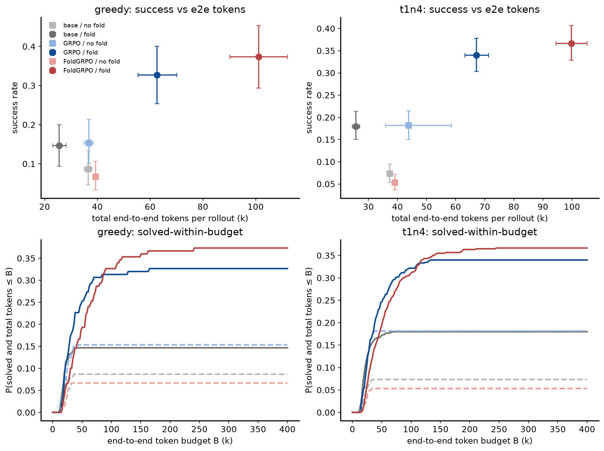
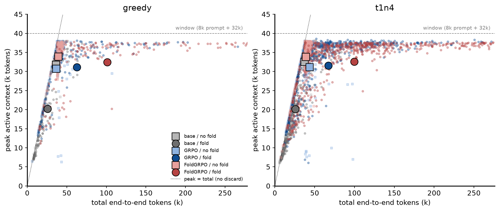
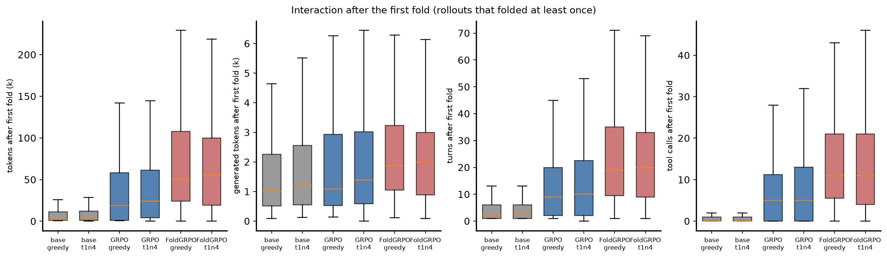
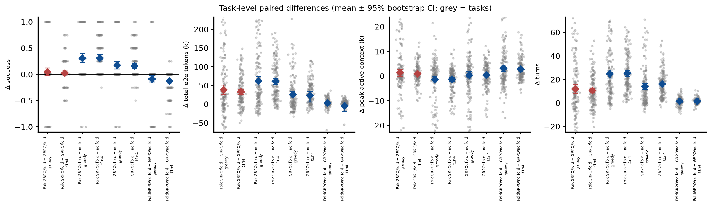
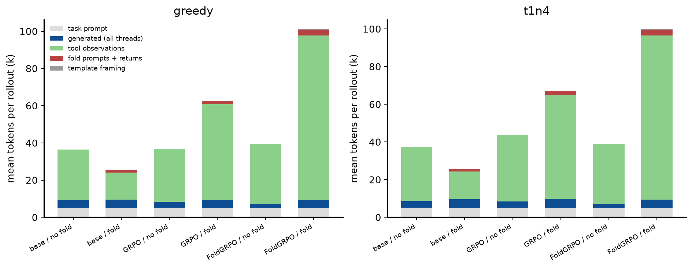

# FoldAgent on BrowseComp-Plus: context efficiency vs end-to-end token usage

*Build: `python3 docs/reports/build_e2e_report.py` (this file, assets and figures are regenerated from the HDFS ledgers). Repo commit at build time: `8aa019b`.*

## 1. Question and design

Does FoldAgent's folding reduce **active context** while *increasing* the total interaction needed to solve the same task?
Three efficiencies are separated: **context efficiency** (peak / mean active context per forward pass), **trajectory efficiency**
(turns, tool calls, tokens generated), and **end-to-end inference efficiency** (every token generated or returned before anything was
folded away, and the cumulative model input over all forward passes).

**Cells.** Training ∈ {no-RL Qwen3-8B base, GRPO checkpoint 60 (59 real steps), FoldGRPO checkpoint 50 (46 real steps)} ×
inference ∈ {**no fold**: `plugin.workflow=search` (the branch tool is removed from the prompt; single-thread ReAct with search/open_page/finish),
**fold**: `plugin.workflow=search_branch` (the training-time prompt with the branch/return tools; the policy decides when to branch, a branch
inherits the main context, runs its own sub-trajectory and is folded to its return message)}. Both RL checkpoints were trained with the
branch tool available: "vanilla GRPO" is the authors' baseline (same agent, plain GRPO, no fold-specific process reward), not a branch-free
ReAct-GRPO. The no-fold cells are therefore an inference-time ablation for every model.

**Evaluation.** Identical to the fix-campaign final evals: 150-item BC-Plus test split, two decodings — greedy (n=1) and T=1.0 top-p=1.0 n=4 —
prompt 8k + response window 32k per thread, `max_turn` 100 across threads, up to 10 branches, gpt-oss-120b judge, self-contained 8×H100 val-only
batch jobs (`infra/worker_val_selfcontained.sh`, `FOLD_WORKFLOW`, `FOLD_E2E_LEDGER=1`). Same tasks and same sampling settings across cells; task-level
pairing by `instance_id` (t1n4 pairs the per-task mean of 4 samples).

**Ledger.** `agents/e2e_ledger.py` records, for every thread of every rollout, each turn's exact token ids the policy generated or was fed
(`scripts/e2e_metrics.py` defines every metric). Folded-away branch tokens are counted in full; a branch's inherited context is counted as
model input of its forward passes, not as new tokens.

| cell | mode | results dir tag | rollouts | status | trainer val score |
|---|---|---|---|---|---|
| base_nofold | greedy | norl_base_greedy_e2e_nobranch_sc | 150 | DONE | 0.087 |
| base_nofold | t1n4 | norl_base_t1n4_e2e_nobranch_sc | 600 | DONE | 0.073 |
| base_fold | greedy | norl_base_greedy_e2e_branch_sc | 150 | DONE | 0.147 |
| base_fold | t1n4 | norl_base_t1n4_e2e_branch_sc | 600 | DONE | 0.180 |
| grpo_nofold | greedy | grpo_60_greedy_e2e_nobranch_sc | 150 | DONE | 0.153 |
| grpo_nofold | t1n4 | grpo_60_t1n4_e2e_nobranch_sc | 600 | DONE | 0.182 |
| grpo_fold | greedy | grpo_60_greedy_e2e_branch_sc | 150 | DONE | 0.327 |
| grpo_fold | t1n4 | grpo_60_t1n4_e2e_branch_t4h_sc | 600 | DONE | 0.340 |
| fold_nofold | greedy | foldgrpo_50_greedy_e2e_nobranch_sc | 150 | DONE | 0.067 |
| fold_nofold | t1n4 | foldgrpo_50_t1n4_e2e_nobranch_sc | 600 | DONE | 0.053 |
| fold_fold | greedy | foldgrpo_50_greedy_e2e_branch_sc | 150 | DONE | 0.373 |
| fold_fold | t1n4 | foldgrpo_50_t1n4_e2e_branch_t4h_sc | 600 | DONE | 0.367 |

## 2. Main tables

### 2.1 All rollouts — greedy
*tokens:*

| cell (train / inference) | n | success | e2e tokens | e2e median | generated | observations | fold in | fold gen | cum. input |
|---|---|---|---|---|---|---|---|---|---|
| base / no fold | 150 | 0.087 | 36,478 | 39,906 | 4,272 | 27,040 | 0 | 0 | 117,601 |
| base / fold | 150 | 0.147 | 25,545 | 20,538 | 4,581 | 14,594 | 1,374 | 3,199 | 103,720 |
| GRPO / no fold | 150 | 0.153 | 36,754 | 39,044 | 3,159 | 28,430 | 0 | 0 | 110,043 |
| GRPO / fold | 150 | 0.327 | 62,627 | 45,094 | 4,301 | 51,531 | 1,755 | 2,872 | 379,794 |
| FoldGRPO / no fold | 150 | 0.067 | 39,315 | 39,814 | 2,064 | 32,082 | 0 | 0 | 150,772 |
| FoldGRPO / fold | 150 | 0.373 | 101,087 | 80,578 | 4,311 | 88,538 | 3,154 | 3,384 | 595,451 |

*interaction and context:*

| cell (train / inference) | n | turns | tool calls | branches | fwd passes | peak ctx | mean ctx | main growth | overlong | post-fold tokens | post-fold turns | post-fold tool calls |
|---|---|---|---|---|---|---|---|---|---|---|---|---|
| base / no fold | 150 | 5.6 | 5.3 | 0.00 | 5.6 | 31,778 | 19,033 | 31,329 | 0.76 | – | – | – |
| base / fold | 150 | 7.3 | 2.6 | 1.72 | 7.3 | 20,213 | 12,276 | 9,394 | 0.11 | 8,678 | 4.4 | 1.1 |
| GRPO / no fold | 150 | 5.4 | 5.0 | 0.00 | 5.4 | 30,734 | 19,335 | 31,605 | 0.71 | – | – | – |
| GRPO / fold | 150 | 19.5 | 12.0 | 2.43 | 19.5 | 31,135 | 18,293 | 10,832 | 0.11 | 38,554 | 14.4 | 8.3 |
| FoldGRPO / no fold | 150 | 6.8 | 6.7 | 0.00 | 6.8 | 33,871 | 21,637 | 34,166 | 0.91 | – | – | – |
| FoldGRPO / fold | 150 | 31.4 | 18.6 | 4.43 | 31.4 | 32,426 | 17,343 | 4,894 | 0.03 | 73,970 | 25.0 | 14.6 |


### 2.2 All rollouts — T=1.0, n=4
*tokens:*

| cell (train / inference) | n | success | e2e tokens | e2e median | generated | observations | fold in | fold gen | cum. input |
|---|---|---|---|---|---|---|---|---|---|
| base / no fold | 600 | 0.073 | 37,334 | 39,758 | 3,526 | 28,641 | 0 | 0 | 133,625 |
| base / fold | 600 | 0.180 | 25,703 | 21,678 | 4,685 | 14,647 | 1,374 | 3,272 | 109,332 |
| GRPO / no fold | 600 | 0.182 | 43,786 | 39,118 | 3,312 | 35,309 | 0 | 0 | 112,726 |
| GRPO / fold | 600 | 0.340 | 67,154 | 50,990 | 4,783 | 55,414 | 1,909 | 3,185 | 436,039 |
| FoldGRPO / no fold | 600 | 0.053 | 39,117 | 40,035 | 1,972 | 31,975 | 0 | 0 | 152,424 |
| FoldGRPO / fold | 600 | 0.367 | 99,818 | 84,308 | 4,342 | 87,296 | 3,095 | 3,362 | 615,312 |

*interaction and context:*

| cell (train / inference) | n | turns | tool calls | branches | fwd passes | peak ctx | mean ctx | main growth | overlong | post-fold tokens | post-fold turns | post-fold tool calls |
|---|---|---|---|---|---|---|---|---|---|---|---|---|
| base / no fold | 600 | 6.2 | 6.0 | 0.00 | 6.2 | 32,517 | 20,020 | 32,185 | 0.82 | – | – | – |
| base / fold | 600 | 7.7 | 2.5 | 1.75 | 7.7 | 20,170 | 11,977 | 8,692 | 0.08 | 8,631 | 4.6 | 1.1 |
| GRPO / no fold | 600 | 5.5 | 5.1 | 0.00 | 5.5 | 31,155 | 19,510 | 38,638 | 0.67 | – | – | – |
| GRPO / fold | 600 | 21.7 | 13.3 | 2.63 | 21.7 | 31,572 | 18,807 | 10,683 | 0.09 | 41,183 | 15.6 | 9.1 |
| FoldGRPO / no fold | 600 | 7.0 | 6.9 | 0.00 | 7.0 | 33,864 | 21,238 | 33,968 | 0.91 | – | – | – |
| FoldGRPO / fold | 600 | 32.2 | 19.5 | 4.48 | 32.2 | 32,568 | 17,563 | 5,009 | 0.03 | 71,346 | 25.2 | 14.9 |


### 2.3 Successful rollouts only — greedy
*tokens:*

| cell (train / inference) | n | success | e2e tokens | e2e median | generated | observations | fold in | fold gen | cum. input |
|---|---|---|---|---|---|---|---|---|---|
| base / no fold | 13 | 1.000 | 22,031 | 20,648 | 2,619 | 14,249 | 0 | 0 | 60,636 |
| base / fold | 22 | 1.000 | 20,096 | 18,512 | 3,412 | 10,830 | 864 | 1,862 | 78,467 |
| GRPO / no fold | 23 | 1.000 | 23,118 | 22,492 | 2,336 | 15,617 | 0 | 0 | 79,277 |
| GRPO / fold | 49 | 1.000 | 38,621 | 29,233 | 2,921 | 29,515 | 1,171 | 1,917 | 237,970 |
| FoldGRPO / no fold | 10 | 1.000 | 23,426 | 24,462 | 1,587 | 16,669 | 0 | 0 | 92,984 |
| FoldGRPO / fold | 56 | 1.000 | 58,653 | 48,424 | 3,086 | 48,343 | 2,184 | 2,430 | 330,826 |

*interaction and context:*

| cell (train / inference) | n | turns | tool calls | branches | fwd passes | peak ctx | mean ctx | main growth | overlong | post-fold tokens | post-fold turns | post-fold tool calls |
|---|---|---|---|---|---|---|---|---|---|---|---|---|
| base / no fold | 13 | 4.1 | 2.9 | 0.00 | 4.1 | 22,031 | 14,410 | 16,880 | 0.00 | – | – | – |
| base / fold | 22 | 5.9 | 2.3 | 1.09 | 5.9 | 18,626 | 11,818 | 7,807 | 0.00 | 2,466 | 1.9 | 0.2 |
| GRPO / no fold | 23 | 4.7 | 3.6 | 0.00 | 4.7 | 23,118 | 16,208 | 17,966 | 0.00 | – | – | – |
| GRPO / fold | 49 | 13.8 | 8.6 | 1.59 | 13.8 | 26,864 | 15,600 | 6,593 | 0.00 | 15,682 | 7.7 | 4.3 |
| FoldGRPO / no fold | 10 | 5.7 | 4.6 | 0.00 | 5.7 | 23,426 | 15,839 | 18,274 | 0.00 | – | – | – |
| FoldGRPO / fold | 56 | 20.6 | 12.0 | 3.07 | 20.6 | 27,852 | 14,494 | 2,754 | 0.00 | 33,427 | 14.1 | 7.8 |


### 2.4 Successful rollouts only — T=1.0, n=4
*tokens:*

| cell (train / inference) | n | success | e2e tokens | e2e median | generated | observations | fold in | fold gen | cum. input |
|---|---|---|---|---|---|---|---|---|---|
| base / no fold | 44 | 1.000 | 22,177 | 22,110 | 2,141 | 14,871 | 0 | 0 | 86,203 |
| base / fold | 108 | 1.000 | 23,787 | 21,483 | 3,380 | 14,350 | 1,066 | 1,923 | 86,989 |
| GRPO / no fold | 109 | 1.000 | 23,650 | 23,772 | 2,259 | 16,232 | 0 | 0 | 81,853 |
| GRPO / fold | 204 | 1.000 | 41,605 | 33,226 | 3,164 | 32,082 | 1,337 | 2,079 | 262,765 |
| FoldGRPO / no fold | 32 | 1.000 | 23,408 | 24,499 | 1,498 | 16,753 | 0 | 0 | 94,055 |
| FoldGRPO / fold | 220 | 1.000 | 58,582 | 47,287 | 3,205 | 48,125 | 2,210 | 2,511 | 346,632 |

*interaction and context:*

| cell (train / inference) | n | turns | tool calls | branches | fwd passes | peak ctx | mean ctx | main growth | overlong | post-fold tokens | post-fold turns | post-fold tool calls |
|---|---|---|---|---|---|---|---|---|---|---|---|---|
| base / no fold | 44 | 5.3 | 4.2 | 0.00 | 5.3 | 22,177 | 15,321 | 17,029 | 0.00 | – | – | – |
| base / fold | 108 | 6.7 | 2.8 | 1.30 | 6.7 | 20,383 | 12,018 | 7,255 | 0.00 | 5,926 | 3.2 | 0.9 |
| GRPO / no fold | 109 | 4.9 | 3.7 | 0.00 | 4.9 | 23,650 | 16,178 | 18,505 | 0.00 | – | – | – |
| GRPO / fold | 204 | 14.9 | 9.1 | 1.81 | 14.9 | 27,336 | 16,209 | 6,989 | 0.00 | 17,326 | 8.1 | 4.4 |
| FoldGRPO / no fold | 32 | 5.9 | 4.9 | 0.00 | 5.9 | 23,408 | 15,678 | 18,268 | 0.00 | – | – | – |
| FoldGRPO / fold | 220 | 21.3 | 12.7 | 3.10 | 21.3 | 28,242 | 14,714 | 3,139 | 0.00 | 33,851 | 14.5 | 8.2 |


Columns: *e2e tokens* = prompt + generated + framing + observations + fold prompts/returns (everything before discard); *fold in* = branch prompts,
overflow-summary prompts and folded return messages injected into contexts; *fold gen* = policy tokens spent on branch-call / return / summary turns;
*cum. input* = Σ input length over all forward passes; *peak ctx* = max input+output length of any forward pass; *post-fold* = after the first fold
(rollouts that folded; NaN otherwise). Means with bootstrap CIs are in `assets/cell_summary.csv`.

### 2.5 Termination
Greedy:

| cell | n | finish | max_turn | session timeout | window exhausted | overlong (main ≥ 32k) | folded ≥1 | branch limit |
|---|---|---|---|---|---|---|---|---|
| base / no fold | 150 | 24% | 0% | 0% | 76% | 76% | 0% | 0% |
| base / fold | 150 | 89% | 0% | 0% | 11% | 11% | 87% | 0% |
| GRPO / no fold | 150 | 29% | 0% | 0% | 71% | 71% | 0% | 0% |
| GRPO / fold | 150 | 89% | 0% | 0% | 11% | 11% | 85% | 1% |
| FoldGRPO / no fold | 150 | 8% | 0% | 0% | 92% | 91% | 0% | 0% |
| FoldGRPO / fold | 150 | 97% | 0% | 0% | 3% | 3% | 98% | 13% |

T=1.0 n=4:

| cell | n | finish | max_turn | session timeout | window exhausted | overlong (main ≥ 32k) | folded ≥1 | branch limit |
|---|---|---|---|---|---|---|---|---|
| base / no fold | 600 | 18% | 0% | 0% | 82% | 82% | 0% | 0% |
| base / fold | 600 | 92% | 0% | 0% | 8% | 8% | 87% | 0% |
| GRPO / no fold | 600 | 33% | 0% | 0% | 67% | 67% | 0% | 0% |
| GRPO / fold | 600 | 91% | 0% | 0% | 9% | 9% | 90% | 2% |
| FoldGRPO / no fold | 600 | 9% | 0% | 0% | 91% | 91% | 0% | 0% |
| FoldGRPO / fold | 600 | 96% | 0% | 0% | 3% | 3% | 99% | 9% |

## 3. Paired task-level comparisons

Greedy (one rollout per task):

| comparison | metric | n tasks | mean Δ [95% CI] | median Δ | % tasks Δ>0 | sign-test p |
|---|---|---|---|---|---|---|
| FoldGRPO/fold − GRPO/fold (same tasks) | success | 150 | 0.047 [-0.027, 0.120] | 0.000 | 13% | 0.281 |
| FoldGRPO/fold − GRPO/fold (same tasks) | total_e2e_tokens | 150 | 38,459 [26,383, 51,096] | 20,903 | 69% | 0.000 |
| FoldGRPO/fold − GRPO/fold (same tasks) | turns | 150 | 11.9 [7.9, 15.9] | 9.0 | 69% | 0.000 |
| FoldGRPO/fold − GRPO/fold (same tasks) | tool_calls | 150 | 6.6 [4.0, 9.2] | 5.0 | 64% | 0.000 |
| FoldGRPO/fold − GRPO/fold (same tasks) | peak_ctx | 150 | 1,291 [-50, 2,709] | 322 | 54% | 0.369 |
| FoldGRPO/fold − GRPO/fold (same tasks) | cum_prompt_tokens | 150 | 215,657 [128,254, 301,375] | 138,373 | 63% | 0.001 |
| FoldGRPO: fold − no fold | success | 150 | 0.307 [0.227, 0.387] | 0.000 | 33% | 0.000 |
| FoldGRPO: fold − no fold | total_e2e_tokens | 150 | 61,772 [51,125, 72,872] | 38,906 | 83% | 0.000 |
| FoldGRPO: fold − no fold | turns | 150 | 24.6 [21.3, 28.1] | 19.0 | 90% | 0.000 |
| FoldGRPO: fold − no fold | tool_calls | 150 | 11.9 [9.7, 14.0] | 8.5 | 81% | 0.000 |
| FoldGRPO: fold − no fold | peak_ctx | 150 | -1,444 [-2,741, -147] | 234 | 54% | 0.326 |
| FoldGRPO: fold − no fold | cum_prompt_tokens | 150 | 444,679 [371,266, 527,580] | 295,167 | 85% | 0.000 |
| GRPO: fold − no fold | success | 150 | 0.173 [0.100, 0.247] | 0.000 | 21% | 0.000 |
| GRPO: fold − no fold | total_e2e_tokens | 150 | 25,873 [18,490, 33,792] | 8,762 | 65% | 0.000 |
| GRPO: fold − no fold | turns | 150 | 14.1 [11.5, 16.9] | 9.5 | 81% | 0.000 |
| GRPO: fold − no fold | tool_calls | 150 | 6.9 [5.2, 8.8] | 4.0 | 66% | 0.000 |
| GRPO: fold − no fold | peak_ctx | 150 | 401 [-1,070, 1,924] | 766 | 52% | 0.683 |
| GRPO: fold − no fold | cum_prompt_tokens | 150 | 269,751 [212,807, 328,598] | 168,095 | 76% | 0.000 |
| FoldGRPO/no fold − GRPO/no fold | success | 150 | -0.087 [-0.147, -0.027] | 0.000 | 3% | 0.011 |
| FoldGRPO/no fold − GRPO/no fold | total_e2e_tokens | 150 | 2,561 [705, 4,364] | 630 | 57% | 0.086 |
| FoldGRPO/no fold − GRPO/no fold | turns | 150 | 1.4 [0.9, 2.0] | 2.0 | 68% | 0.000 |
| FoldGRPO/no fold − GRPO/no fold | tool_calls | 150 | 1.7 [1.2, 2.3] | 2.0 | 69% | 0.000 |
| FoldGRPO/no fold − GRPO/no fold | peak_ctx | 150 | 3,136 [1,867, 4,442] | 1,714 | 61% | 0.009 |
| FoldGRPO/no fold − GRPO/no fold | cum_prompt_tokens | 150 | 40,728 [26,814, 54,441] | 46,297 | 73% | 0.000 |
| base: fold − no fold | success | 150 | 0.060 [-0.013, 0.133] | 0.000 | 13% | 0.136 |
| base: fold − no fold | total_e2e_tokens | 150 | -10,933 [-13,825, -8,125] | -13,123 | 27% | 0.000 |
| base: fold − no fold | turns | 150 | 1.7 [0.8, 2.6] | 1.0 | 55% | 0.012 |
| base: fold − no fold | tool_calls | 150 | -2.7 [-3.5, -2.0] | -3.0 | 21% | 0.000 |
| base: fold − no fold | peak_ctx | 150 | -11,566 [-13,605, -9,500] | -14,278 | 23% | 0.000 |
| base: fold − no fold | cum_prompt_tokens | 150 | -13,880 [-34,924, 8,480] | -24,714 | 37% | 0.001 |
| FoldGRPO/fold − GRPO/no fold | success | 150 | 0.220 [0.140, 0.300] | 0.000 | 26% | 0.000 |
| FoldGRPO/fold − GRPO/no fold | total_e2e_tokens | 150 | 64,332 [53,558, 75,568] | 43,157 | 88% | 0.000 |
| FoldGRPO/fold − GRPO/no fold | turns | 150 | 26.0 [22.6, 29.5] | 21.0 | 97% | 0.000 |
| FoldGRPO/fold − GRPO/no fold | tool_calls | 150 | 13.6 [11.5, 15.7] | 10.0 | 89% | 0.000 |
| FoldGRPO/fold − GRPO/no fold | peak_ctx | 150 | 1,692 [207, 3,098] | 1,466 | 63% | 0.001 |
| FoldGRPO/fold − GRPO/no fold | cum_prompt_tokens | 150 | 485,407 [410,751, 562,530] | 334,877 | 94% | 0.000 |

T=1.0 n=4 (per-task mean of 4 samples):

| comparison | metric | n tasks | mean Δ [95% CI] | median Δ | % tasks Δ>0 | sign-test p |
|---|---|---|---|---|---|---|
| FoldGRPO/fold − GRPO/fold (same tasks) | success | 150 | 0.027 [-0.008, 0.062] | 0.000 | 20% | 0.262 |
| FoldGRPO/fold − GRPO/fold (same tasks) | total_e2e_tokens | 150 | 32,663 [26,292, 39,001] | 24,930 | 81% | 0.000 |
| FoldGRPO/fold − GRPO/fold (same tasks) | turns | 150 | 10.5 [8.4, 12.6] | 9.5 | 79% | 0.000 |
| FoldGRPO/fold − GRPO/fold (same tasks) | tool_calls | 150 | 6.3 [4.9, 7.6] | 5.4 | 79% | 0.000 |
| FoldGRPO/fold − GRPO/fold (same tasks) | peak_ctx | 150 | 996 [393, 1,624] | 648 | 57% | 0.086 |
| FoldGRPO/fold − GRPO/fold (same tasks) | cum_prompt_tokens | 150 | 179,274 [133,413, 227,503] | 141,262 | 78% | 0.000 |
| FoldGRPO: fold − no fold | success | 150 | 0.313 [0.253, 0.377] | 0.000 | 47% | 0.000 |
| FoldGRPO: fold − no fold | total_e2e_tokens | 150 | 60,700 [52,755, 68,772] | 47,522 | 92% | 0.000 |
| FoldGRPO: fold − no fold | turns | 150 | 25.1 [22.6, 27.7] | 21.1 | 100% | 0.000 |
| FoldGRPO: fold − no fold | tool_calls | 150 | 12.6 [10.9, 14.3] | 11.0 | 90% | 0.000 |
| FoldGRPO: fold − no fold | peak_ctx | 150 | -1,296 [-2,123, -541] | 67 | 51% | 0.807 |
| FoldGRPO: fold − no fold | cum_prompt_tokens | 150 | 462,888 [405,310, 522,060] | 359,591 | 93% | 0.000 |
| GRPO: fold − no fold | success | 150 | 0.158 [0.115, 0.203] | 0.000 | 35% | 0.000 |
| GRPO: fold − no fold | total_e2e_tokens | 150 | 23,368 [5,770, 34,364] | 22,890 | 84% | 0.000 |
| GRPO: fold − no fold | turns | 150 | 16.2 [14.4, 18.0] | 14.0 | 99% | 0.000 |
| GRPO: fold − no fold | tool_calls | 150 | 8.2 [7.0, 9.4] | 6.9 | 90% | 0.000 |
| GRPO: fold − no fold | peak_ctx | 150 | 417 [-400, 1,208] | 983 | 57% | 0.086 |
| GRPO: fold − no fold | cum_prompt_tokens | 150 | 323,313 [283,797, 365,376] | 279,956 | 95% | 0.000 |
| FoldGRPO/no fold − GRPO/no fold | success | 150 | -0.128 [-0.168, -0.090] | 0.000 | 2% | 0.000 |
| FoldGRPO/no fold − GRPO/no fold | total_e2e_tokens | 150 | -4,669 [-19,650, 3,296] | 1,479 | 66% | 0.000 |
| FoldGRPO/no fold − GRPO/no fold | turns | 150 | 1.5 [1.2, 1.9] | 1.5 | 76% | 0.000 |
| FoldGRPO/no fold − GRPO/no fold | tool_calls | 150 | 1.9 [1.5, 2.2] | 1.8 | 81% | 0.000 |
| FoldGRPO/no fold − GRPO/no fold | peak_ctx | 150 | 2,709 [2,043, 3,400] | 2,070 | 72% | 0.000 |
| FoldGRPO/no fold − GRPO/no fold | cum_prompt_tokens | 150 | 39,698 [30,450, 49,278] | 35,758 | 79% | 0.000 |
| base: fold − no fold | success | 150 | 0.107 [0.070, 0.147] | 0.000 | 26% | 0.000 |
| base: fold − no fold | total_e2e_tokens | 150 | -11,631 [-13,076, -10,203] | -12,720 | 10% | 0.000 |
| base: fold − no fold | turns | 150 | 1.5 [0.7, 2.3] | 0.5 | 59% | 0.021 |
| base: fold − no fold | tool_calls | 150 | -3.4 [-3.8, -3.1] | -3.5 | 7% | 0.000 |
| base: fold − no fold | peak_ctx | 150 | -12,347 [-13,224, -11,448] | -13,014 | 1% | 0.000 |
| base: fold − no fold | cum_prompt_tokens | 150 | -24,293 [-39,808, -6,712] | -44,094 | 28% | 0.000 |
| FoldGRPO/fold − GRPO/no fold | success | 150 | 0.185 [0.137, 0.235] | 0.000 | 37% | 0.000 |
| FoldGRPO/fold − GRPO/no fold | total_e2e_tokens | 150 | 56,031 [37,115, 69,161] | 50,009 | 96% | 0.000 |
| FoldGRPO/fold − GRPO/no fold | turns | 150 | 26.7 [24.2, 29.3] | 22.2 | 99% | 0.000 |
| FoldGRPO/fold − GRPO/no fold | tool_calls | 150 | 14.4 [12.9, 16.0] | 12.0 | 98% | 0.000 |
| FoldGRPO/fold − GRPO/no fold | peak_ctx | 150 | 1,412 [677, 2,169] | 2,058 | 69% | 0.000 |
| FoldGRPO/fold − GRPO/no fold | cum_prompt_tokens | 150 | 502,587 [447,143, 559,534] | 398,808 | 99% | 0.000 |

## 4. Figures


*Fig. 1 — Success vs total end-to-end tokens (top: cell means ± 95% CI; bottom: fraction of rollouts solved within an end-to-end token budget).*


*Fig. 2 — Peak active context vs total end-to-end tokens per rollout (large markers = cell means; axes clipped at the 99.5th percentile — one GRPO/no-fold T=1 rollout received a single 4.2M-token observation). Points below the dotted diagonal discarded tokens.*


*Fig. 3 — Interaction after the first fold, for rollouts that folded.*


*Fig. 4 — Paired per-task differences (y-axes clipped to the 1st–99th percentile of task differences).*


*Fig. 5 — Where the end-to-end tokens go.*

## 5. Findings

**Headline.** On the same 150 tasks, FoldAgent's folding does **not** buy shorter active context for free. For both RL checkpoints the peak
active context is the same with or without folding (every policy saturates the 32k window somewhere in the trajectory; paired Δpeak ≈ 0),
the mean context per forward pass drops only 10–20 %, and in exchange the trajectory becomes 3–5× longer in turns and 1.7–2.6× longer in
end-to-end tokens, with 3.5–5.5× the cumulative model input. Most of that extra interaction happens **after the first fold**. FoldGRPO
training does not learn to compensate for this: it learns to fold more and to spend ~60 % more end-to-end tokens than the plain-GRPO policy
on the same tasks, for a success gain that is not significant (greedy +0.047 [−0.03, 0.12]; T=1.0 n=4: +0.027 [−0.01, 0.06]).

**1. Context efficiency (what folding actually changes).** Greedy, all rollouts: peak active context 31.1k (GRPO/fold) vs 30.7k (GRPO/no fold)
and 32.4k (FoldGRPO/fold) vs 33.9k (FoldGRPO/no fold) — paired Δpeak +0.4k [−1.3k, 1.9k] and −1.4k [−2.8k, −0.2k]. The window is hit either
in the main thread (no fold) or inside a branch (fold). Mean input length per forward pass: 18.3k / 17.3k with folding vs 19.3k / 21.6k without.
Only the untrained base model gets a real context reduction from folding (peak 20.2k vs 31.8k, −11.6k paired), because it returns from
branches after ~2 tool calls.

**2. Trajectory efficiency (interaction).** Folding multiplies interaction: turns 19.5 vs 5.4 (GRPO) and 31.4 vs 6.8 (FoldGRPO); tool calls
12.0 vs 5.0 and 18.6 vs 6.7; branches per rollout 2.4 (GRPO) and 4.4 (FoldGRPO). Of the fold cells' end-to-end tokens, 62 % (GRPO) and 73 %
(FoldGRPO) are generated or returned after the first fold (38.6k / 74.0k tokens, 14.4 / 25.0 turns; Fig. 3). Restricting to successful
rollouts the pattern is the same: a solved task costs 23.1k e2e tokens for GRPO/no fold, 38.6k for GRPO/fold and 58.7k for FoldGRPO/fold
(20.1k for base/fold).

**3. End-to-end inference efficiency.** Greedy means (medians): e2e tokens 36.8k (39.0k) GRPO/no fold → 62.6k (45.1k) GRPO/fold → 101.1k (80.6k)
FoldGRPO/fold; cumulative model input 110k → 380k → 595k tokens per rollout. Paired on the same tasks, FoldGRPO/fold − GRPO/fold = +38.5k
e2e tokens [26k, 51k], +11.9 turns, +6.6 tool calls, +216k cumulative input (all p < 0.001), for +0.047 success (p = 0.28). The
solved-within-budget curves (Fig. 1, bottom) show GRPO/fold dominating FoldGRPO/fold up to an end-to-end budget of ~100k tokens
(B = 50k: 0.253 vs 0.193; 75k: 0.307 vs 0.287); FoldGRPO/fold only pulls ahead when > 100k tokens per task are allowed (0.373 vs 0.327 at 400k).

**4. Why the no-fold cells are not simply "cheaper".** Without the branch tool both RL policies die at the window: 71 % (GRPO) and 91 %
(FoldGRPO) of rollouts end with the 32k window exhausted before an answer (success 0.153 and 0.067; FoldGRPO/no fold is *below the base model*,
0.087). Their low e2e token counts are the cost of a killed trajectory, not of an efficient one. Folding converts the hard window limit into a
soft budget on interaction: finish rate 89 % / 97 %, window exhaustion 11 % / 3 %. So the honest reading is: folding buys *survival past the
window*, and the trained policies pay for it with interaction, not with a smaller active context.

**5. What FoldGRPO training learned.** Relative to GRPO with the same tool: +2 branches per rollout, +60 % e2e tokens, 13 % of greedy rollouts
hit the 10-branch limit (GRPO 1 %), and complete dependence on the tool (no-fold success 0.067 vs GRPO's 0.153). It did learn to *stop*:
97 % finish and 3 % window exhaustion (GRPO 89 % / 11 %), and its main thread is shorter — but the stopping is achieved by delegating more
work to branches, i.e. by spending more end-to-end tokens, not by needing less post-fold interaction. Neither "reduces context occupancy
without increasing future interaction" nor "learns to compensate for post-compaction interaction" holds; "trades shorter (mean) context for
more search/reasoning" is the description the data supports.

**6. Sampling (T=1.0, n=4) reproduces the greedy picture.** With the fold cells re-run under a 4 h session timeout (see below), the
sampled results agree with greedy on every axis: success 0.340 (GRPO/fold) vs 0.367 (FoldGRPO/fold), paired Δ = +0.027 [−0.008, 0.062],
p = 0.26; e2e tokens 67.2k vs 99.8k (paired +32.7k [26k, 39k]); turns 21.7 vs 32.2 (+10.5); branches 2.6 vs 4.5; cumulative model input
391k vs 574k (+179k); peak context 31.6k vs 32.6k (Δ +1.0k); finish rate 91 % vs 96 %, window exhaustion 9 % vs 3 %; 58 % vs 71 % of the
fold cells' tokens fall after the first fold; a solved task costs 41.6k vs 58.6k e2e tokens. The solved-within-budget curves cross between
100k and 150k tokens per task (B = 50k: 0.247 vs 0.197; 100k: 0.322 vs 0.310; 150k: 0.340 vs 0.355; 400k: 0.340 vs 0.367).

*Timeout artefact and re-runs.* The val worker's default 1 h session timeout is not binding for greedy (median session 8–12 min) or for the
no-fold cells, but the 600 concurrent sampled rollouts of the fold cells are throughput-bound on the shared search + judge pod (median session
50–55 min): the first T=1 runs lost 10 % (GRPO/fold) and 34 % (FoldGRPO/fold) of rollouts to the timeout, all scored 0 with truncated token
counts (success read 0.317 / 0.317). Both cells were re-run with `FOLD_SESSION_TIMEOUT=14400` (jobs c5220b294491facc and 5fc30e5bf85e8cc1;
tag `_e2e_branch_t4h`; 0 timeouts in either) and the tables above use the re-runs. The 1 h results are kept under the original tags for
reference; they underestimate both the success and the cost of folding.


## 6. Caveats

- Both RL checkpoints are truncated runs (46 / 59 real steps) from the fix campaign and were trained *with* the branch tool; the no-fold cells
  are an inference-time ablation with a different system prompt (`search` vs `search_branch`), so they measure "the same policy without the
  ability to fold", not a branch-free-trained baseline.
- "Compaction" here is FoldAgent's branch/fold; the CompactionRL-style summary compaction (`compactiongrpo` arm) was still training and is not included.
- Judge = gpt-oss-120b (not the paper's GPT models); success = judge-graded correctness of the final answer (0/1).
- The bottom of the 32k window: a thread that fills its window keeps its partial context; `overlong` marks main threads that reached the window.
- Token counts are exact ids from the ledger; the branch's inherited context is re-rendered by the chat template (±1 token per inherited turn).
- Greedy decoding on vLLM is not bit-reproducible across nodes; t1n4 CIs reflect sampling noise over 4 samples × 150 tasks.

## 7. Reproduce

```
# 1. jobs (already submitted; specs in infra/jobs/fold_e2e_*_h100.json, ledger in infra/jobs/JOBS.tsv)
cd ~/xiaoxuan/FoldAgent/infra/jobs && merlin-cli --control-plane i18n-tt job-v2 runs create --from-file fold_e2e_grpo60_branch_h100.json   # ... x6
# 2. report (reads /mnt/hdfs/mlsys/xiaoxuan/fold_replication/results/valonly_*_e2e_*_sc/ledger)
python3 docs/reports/build_e2e_report.py
# tests: ~/xiaoxuan/envs/fold_train/bin/python -m unittest tests.test_e2e_ledger tests.test_e2e_metrics
```
Artifacts: `docs/reports/2026-09-17_foldagent_e2e_token_usage_report_assets/` (rollouts.csv = one row per rollout with every metric; cell_summary.csv; paired_diffs.csv; figures as PNG+PDF with JSON data).
